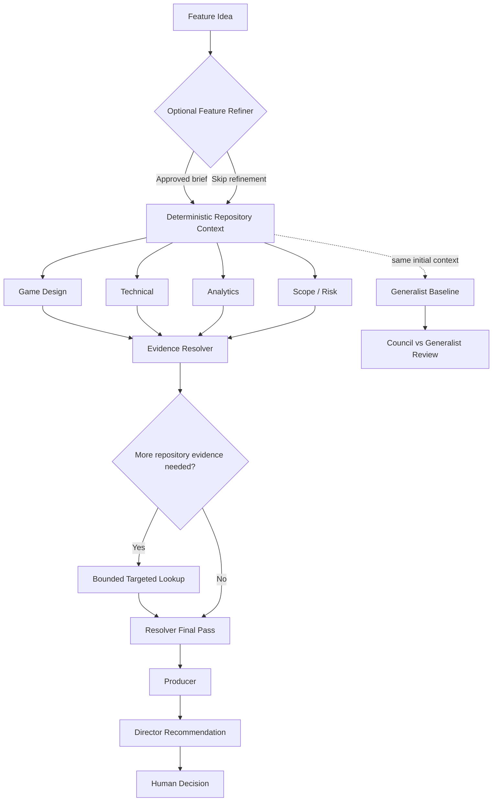

# Game Feature Council

**Repository-grounded AI decision support for game feature development.**

Game Feature Council helps answer a practical question before implementation starts:

> **What is the smallest useful version of this feature worth testing first?**

Give it a feature idea and a Git repository. It investigates what already exists in the codebase, evaluates the idea from several perspectives, identifies important unknowns, and recommends a smaller experiment, prototype, or next step.

The goal is **not to let AI approve features or replace engineering judgement**.

The goal is to reduce unnecessary investigation and implementation before a developer or product owner makes the final decision.

**[View Example Decision Report](https://rk042.github.io/game-feature-council/)**

---

## Why this exists

A feature request often sounds simple:

> “Add a new mechanic where doing X creates Y.”

But before implementation starts, someone still has to answer:

- What already exists in the project?
- Can existing systems be reused?
- What part of the feature is actually uncertain?
- What is required to test the idea?
- What can be deliberately left out of the first version?
- Which questions can the repository answer without interrupting a developer?
- Is a full implementation justified yet?

Game Feature Council performs that investigation against a bounded snapshot of the actual repository and turns it into an **MVP decision brief**.

---

## Example

Imagine a Unity Match-3 project where the requested feature is:

> Merging five gems should create a special gem.  
> Merging that special gem with another gem should clear all gems of the matching type.

Repository analysis finds that the project already contains type-based clearing and bonus-gem behavior.

Instead of recommending the complete feature immediately, the Council may recommend:

1. Manually place the special gem in a controlled test.
2. Activate it against a selected gem type.
3. Reuse the existing board-clearing behavior.
4. Verify that the correct gems are removed.
5. Verify that normal gameplay continues correctly.
6. Only then implement the real five-gem creation trigger.

Result:

**PROTOTYPE_FIRST**

The first experiment answers the important technical uncertainty without building the whole feature.

That is the type of decision Game Feature Council is designed to support.

---

## What it does

Game Feature Council can:

- interpret and refine a feature request before repository analysis;
- build deterministic, bounded context from a Git working tree;
- evaluate the feature from Game Design, Technical, Analytics, and Scope/Risk perspectives;
- reconcile overlapping concerns using an Evidence Resolver;
- perform a bounded repository lookup when important evidence is missing;
- synthesize the smallest credible experiment;
- produce a Director recommendation;
- compare the multi-agent Council with a single Generalist baseline;
- record token usage, model calls, duration, and estimated API cost;
- generate deterministic JSON, Markdown, and self-contained HTML reports;
- support a final human review without another model call.

The human remains the final decision-maker.

---

## What it does not do

Game Feature Council is **not**:

- an autonomous coding agent;
- a feature implementation tool;
- a replacement for product, design, or engineering judgement;
- a production-release approval system;
- a guarantee that an AI recommendation is correct;
- a tool that writes into the repository being analyzed.

Its job ends at **decision support and experiment definition**.

---

## How it works



### Council roles

| Role | Responsibility |
|---|---|
| **Game Design** | Defines the minimum player experience required to test the idea. |
| **Technical** | Identifies reuse points, required changes, integration risks, and implementation unknowns. |
| **Analytics** | Defines what should be measured and what different outcomes would teach us. |
| **Scope / Risk** | Challenges unnecessary scope and surfaces important product, economy, trust, and technical risks. |
| **Evidence Resolver** | Consolidates concerns and checks whether repository evidence can resolve them. |
| **Producer** | Converts the evidence and specialist analysis into one coherent MVP experiment. |
| **Director** | Decides whether that experiment is worth proceeding with. |
| **Generalist** | Provides an isolated single-model baseline for comparison. |

---

## Possible recommendations

The Director returns one of five decisions:

| Decision | Meaning |
|---|---|
| `GO` | The proposed experiment is credible enough to proceed. |
| `GO_WITH_REDUCED_SCOPE` | Proceed, but remove unnecessary scope. |
| `PROTOTYPE_FIRST` | Validate a smaller or cheaper uncertainty before larger implementation. |
| `NEEDS_MORE_INFORMATION` | Important evidence is still missing. |
| `DO_NOT_BUILD_YET` | Current evidence, risk, cost, or expected learning does not justify proceeding yet. |

None of these decisions mean **release to production**.

Human approval is always required.

---

# Quick start

## Requirements

- Python **3.11 or 3.12**
- Git
- OpenAI API access for real model runs

The V1 release has primarily been developed and audited on Windows with Python 3.12.

## Clone

```powershell
git clone https://github.com/rk042/game-feature-council.git
cd game-feature-council
```

## Create an environment

```powershell
py -3.12 -m venv .venv
.\.venv\Scripts\Activate.ps1
python -m pip install -e .
```

Verify the installation:

```powershell
council --help
```

You can also run the project without activating the environment:

```powershell
.\.venv\Scripts\python.exe -m council --help
```

---

## Configure models

For a real analysis run, configure the API key and models in the current PowerShell session:

```powershell
$env:OPENAI_API_KEY = "your-api-key"

$env:COUNCIL_SPECIALIST_MODEL = "gpt-5.4-nano"
$env:COUNCIL_SYNTHESIS_MODEL = "gpt-5.4-nano"

# Optional
$env:COUNCIL_REFINER_MODEL = "gpt-5.4-nano"
$env:COUNCIL_RESOLVER_MODEL = "gpt-5.4-nano"
```

`COUNCIL_RESOLVER_MODEL` falls back to the configured synthesis model when it is not specified.

Do not put API keys in committed files.

The API key is not written into run artifacts.

---

# Run the interactive workflow

The easiest way to use Game Feature Council is the guided CLI:

```powershell
council
```

or:

```powershell
.\.venv\Scripts\python.exe -m council
```

The wizard walks through:

```text
Repository
    ↓
Feature request
    ↓
Council / Generalist / Both
    ↓
Optional API cost cap
    ↓
Optional Feature Refiner
    ↓
Repository analysis consent
    ↓
Analysis
    ↓
Decision report
    ↓
Human review
```

The root wizard is recommended for first-time use.

For scripted workflows, see:

```powershell
council run --help
```

For offline human review:

```powershell
council review --help
```

For local CLI settings:

```powershell
council config --help
```

---

# Feature input

Feature requests are plain UTF-8 text.

A short feature can be entered directly in the interactive wizard.

Longer specifications can use a feature file.

A generic example is available at:

```text
examples/feature.txt
```

The feature can describe things such as:

```text
Player problem
Feature idea
Goal
Constraints
Known requirements
Open questions
Things that should remain unchanged
```

The tool does not require a special JSON schema for feature requests.

---

# Optional Feature Refiner

The interactive workflow can optionally use an AI Feature Refiner before repository analysis.

The Refiner:

- receives the feature description only;
- does **not** receive repository content;
- identifies ambiguity and preserved constraints;
- proposes a clearer feature brief;
- requires user approval before the refined version is used.

Skipping refinement preserves the original request unchanged.

The Refiner is a separate model call and therefore has its own API cost.

---

# Repository grounding

Repository context is built deterministically before the Council runs.

The Context Builder:

- validates that the target is a Git repository;
- reads tracked working-tree content;
- includes relevant tracked local modifications;
- excludes untracked files;
- selects a bounded number of relevant files and excerpts;
- assigns deterministic evidence identifiers such as `repo-001`;
- does not modify the target repository.

The initial repository context is treated as immutable during the Council run.

When the Evidence Resolver requires more information, the system may perform a **bounded supplemental lookup**.

Supplemental evidence receives separate identifiers such as:

```text
resolver-repo-001
resolver-repo-002
```

This preserves provenance between the original context and later evidence.

---

# Evidence Resolver

The Evidence Resolver exists to answer one rule:

> **Never ask a human something the repository or existing Council evidence can answer first.**

It consolidates concerns raised by the four specialists and determines whether each concern is:

```text
Resolved from repository evidence
Mitigated
Requires an experiment
Requires a human product decision
Requires human help locating repository information
```

When repository information may answer a concern, the workflow performs a bounded lookup before escalating that repository question to the user.

The Resolver is limited to at most two model passes.

---

# Fail-closed evidence rules

Game Feature Council deliberately treats evidence integrity differently from ordinary uncertainty.

The workflow stops when trust in provenance is broken, for example when a model:

- invents an evidence identifier;
- invents a source concern identifier;
- references supplemental evidence that does not exist;
- violates required structured output.

Normal uncertainty does **not** automatically stop the run.

If the repository simply cannot answer a question, the workflow can instead classify it as:

```text
Requires experiment
Human product decision
Human repository help
Needs more information
```

The principle is:

> **Uncertainty is acceptable. Fabricated provenance is not.**

---

# Council vs Generalist

Game Feature Council includes a single-model Generalist baseline.

This is intentionally isolated.

The Generalist receives:

```text
Approved feature
+
Original initial repository context
```

It does **not** receive:

```text
Specialist outputs
Evidence Resolver output
Supplemental repository evidence
Producer output
Director output
Council report
Human review
```

This makes the comparison useful for evaluating whether the multi-agent workflow actually adds value over one strong model.

---

# Reports and artifacts

A completed run produces deterministic artifacts such as:

```text
run.json
report.md
report.html
specialist outputs
resolver output
producer output
director output
comparison data
telemetry
```

The HTML report is self-contained and designed as an **MVP Decision Brief**.

Its first layer focuses on:

```text
What You Asked
Recommendation
Why
What Already Exists
What Is Still Open
Recommended MVP
What Not To Build Yet
What We Will Learn
What Success Looks Like
Effort / Estimation
What Happens Next
```

Detailed agent analysis, evidence, telemetry, and audit information appear later in the report.

Report generation is deterministic and does not require another model call.

## Example Decision Report

See what Game Feature Council produces without installing anything.

The public example is based on a real Unity Match-3 analysis, with repository-specific details sanitized for demonstration.

**[View the live example report](https://rk042.github.io/game-feature-council/)**

---

# Cost controls

Model calls cost money.

Before repository content is sent, the CLI shows a preflight estimate including:

- configured models;
- expected model calls;
- rough input size;
- output-token allowance;
- estimated cost;
- conservative cost estimate.

An optional maximum API cost can be configured for the run.

Actual usage records include:

```text
Model
Requests
Input tokens
Output tokens
Total tokens
Duration
Estimated cost
Pricing snapshot
```

Unknown model pricing is reported as unavailable instead of inventing a cost.

---

# Privacy and repository safety

Game Feature Council is designed to make repository access explicit.

### Before model analysis

The CLI shows what will happen and requires explicit consent before repository content is sent to the configured model provider.

### Feature Refiner

Only the feature description is sent.

Repository content is not sent to the Refiner.

### Target repository

The project treats the analyzed repository as read-only.

Game Feature Council does not:

```text
modify source files
commit changes
push Git branches
change Git configuration
run Unity
deploy services
modify production systems
```

Output locations inside the analyzed target repository are rejected.

### API key

`OPENAI_API_KEY` is read from the environment.

It is not intentionally persisted in run artifacts or printed by the CLI.

### SDK tracing

OpenAI Agents SDK tracing is disabled by default by the project.

Local model-call, token, duration, and estimated-cost telemetry remains available independently.

---

# Local convenience data

The interactive CLI can remember up to five previously used repository paths.

On Windows this is stored under:

```text
%LOCALAPPDATA%\game-feature-council\recent-repositories.json
```

Only repository paths are stored there.

Feature text, repository contents, and API keys are not stored in that history.

Clear it with:

```powershell
council config clear-recent
```

---

# Project structure

```text
game-feature-council/
├── council/
│   ├── agents.py
│   ├── cli.py
│   ├── context.py
│   ├── evaluation.py
│   ├── evidence_resolver.py
│   ├── execution.py
│   ├── html_reporting.py
│   ├── models.py
│   ├── orchestrator.py
│   ├── presentation.py
│   ├── pricing.py
│   ├── refinement.py
│   └── reporting.py
│
├── prompts/
│   ├── feature_refiner.md
│   ├── game_design.md
│   ├── technical.md
│   ├── analytics.md
│   ├── scope_risk.md
│   ├── evidence_resolver.md
│   ├── producer.md
│   ├── director.md
│   └── generalist.md
│
├── docs/
│   ├── GAME_FEATURE_COUNCIL.md
│   ├── EVALUATION.md
│   └── DECISIONS.md
│
├── examples/
│   └── feature.txt
│
├── tests...
├── LICENSE
├── NOTICE
├── THIRD_PARTY_NOTICES.md
├── pyproject.toml
└── README.md
```

---

# Architecture source of truth

The README is the project overview.

More detailed architecture and evaluation rules live in:

- [`docs/GAME_FEATURE_COUNCIL.md`](docs/GAME_FEATURE_COUNCIL.md) — architecture and operating contract
- [`docs/EVALUATION.md`](docs/EVALUATION.md) — Council vs Generalist evaluation methodology
- [`docs/DECISIONS.md`](docs/DECISIONS.md) — V1 architectural decisions and deviations

When documentation conflicts, implementation and tests should be checked before changing documented invariants.

---

# AI and contributor context

This section exists to make the repository easier for both human contributors and AI coding agents to work with safely.

## Important implementation boundaries

| Area | Source |
|---|---|
| CLI and user workflow | `council/cli.py` |
| Model execution boundary | `council/execution.py` |
| Repository context selection | `council/context.py` |
| Agent definitions | `council/agents.py` |
| Structured schemas | `council/models.py` |
| Council orchestration | `council/orchestrator.py` |
| Evidence resolution | `council/evidence_resolver.py` |
| Feature refinement | `council/refinement.py` |
| Markdown / JSON reporting | `council/reporting.py` |
| HTML reporting | `council/html_reporting.py` |
| Prompts | `prompts/` |
| Architecture contract | `docs/GAME_FEATURE_COUNCIL.md` |

## V1 invariants

Contributors and AI agents should preserve these unless the architecture is deliberately changed and documented:

1. **The target repository is read-only.**
2. **Repository evidence must have valid provenance.**
3. **Unknown evidence identifiers must fail closed.**
4. **Do not repair fabricated model references using fuzzy matching.**
5. **The initial ContextBundle remains immutable.**
6. **Supplemental Resolver evidence remains separately identifiable.**
7. **Repository lookup should happen before requesting human repository help.**
8. **Generalist evaluation remains isolated from Council outputs.**
9. **Human approval remains required.**
10. **There is no automatic production authorization.**
11. **Reports are generated deterministically without another model call.**
12. **API keys must never be written to artifacts or logs.**
13. **Ordinary missing information should become explicit uncertainty rather than fabricated certainty.**

A useful summary for automated contributors is:

> **Preserve evidence provenance, read-only repository access, Generalist isolation, deterministic reporting, bounded model workflows, and human final authority.**

---

# Testing

Run the complete test suite:

```powershell
.\.venv\Scripts\python.exe -m unittest discover
```

Check Python compilation:

```powershell
.\.venv\Scripts\python.exe -m compileall council
```

Check release whitespace:

```powershell
git diff --check
```

V1 release preparation currently uses these checks as part of the public-release audit.

---

# Project status

Game Feature Council is an **experimental open-source V1**.

It is intended for:

- experimentation;
- developer decision support;
- repository-grounded feature investigation;
- comparing multi-agent and single-agent evaluation approaches.

It should not be treated as an autonomous production decision system.

Issues, experiments, and contributions are welcome.

Maintenance and feature requests are handled on a **best-effort basis**; publishing the project does not create a support or maintenance commitment.

---

# Contributing

Forks and pull requests are welcome.

When changing core workflow behavior, please preserve the V1 invariants above and include tests for changes affecting:

```text
repository safety
evidence provenance
structured model output
Council orchestration
Generalist isolation
privacy
cost controls
reporting
```

For larger architecture changes, opening an issue before implementation is recommended.

---

# License

Game Feature Council is licensed under the **Apache License 2.0**.

See:

- [`LICENSE`](LICENSE)
- [`NOTICE`](NOTICE)
- [`THIRD_PARTY_NOTICES.md`](THIRD_PARTY_NOTICES.md)

You may use, modify, fork, distribute, and commercially use the project subject to the terms of the Apache License 2.0 and applicable third-party licenses.

---

# Author

**Ketan Rathod**

Game developer and software engineer exploring practical AI-assisted engineering workflows.

---

## Documentation

For deeper technical details:

- [Architecture and operating contract](docs/GAME_FEATURE_COUNCIL.md)
- [Council vs Generalist evaluation](docs/EVALUATION.md)
- [V1 decision log](docs/DECISIONS.md)